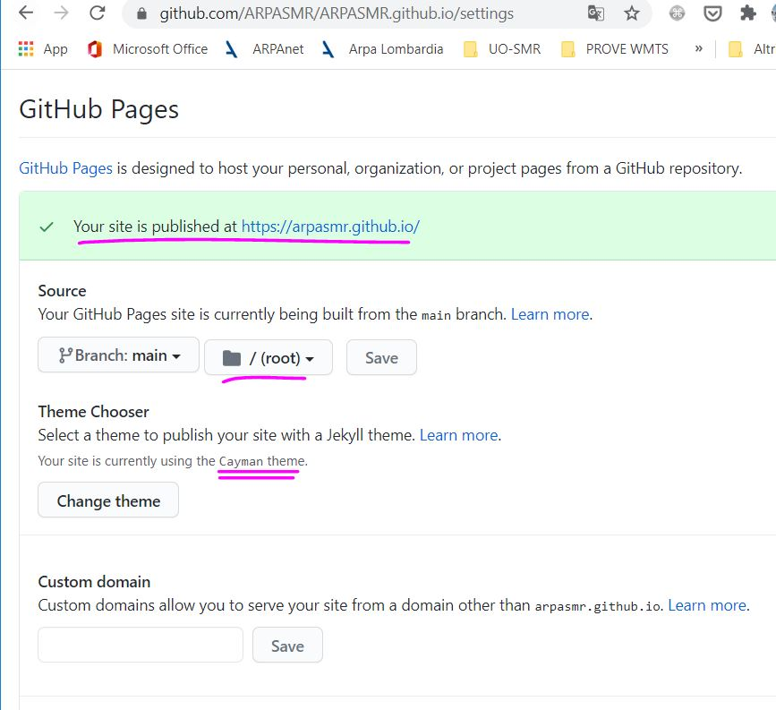
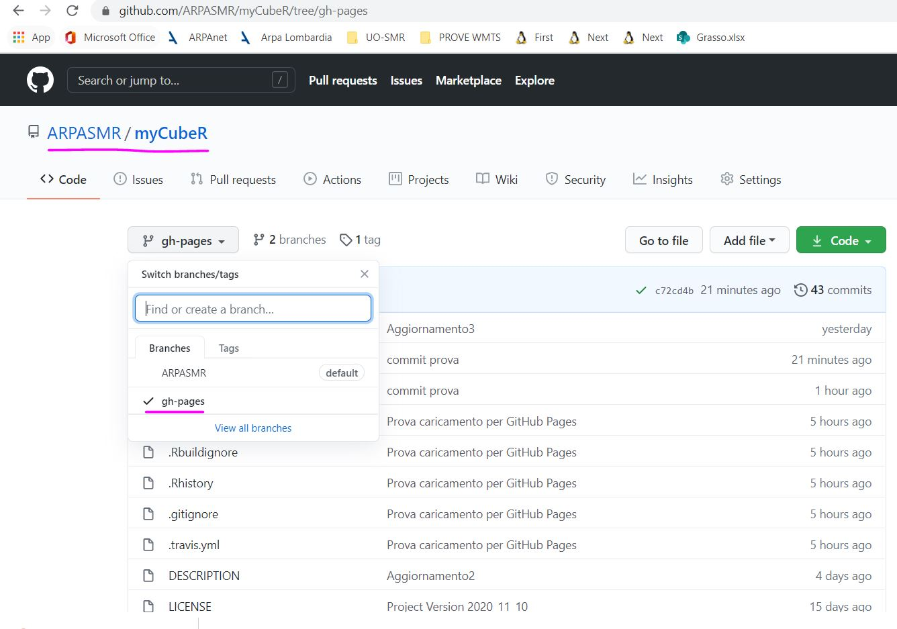
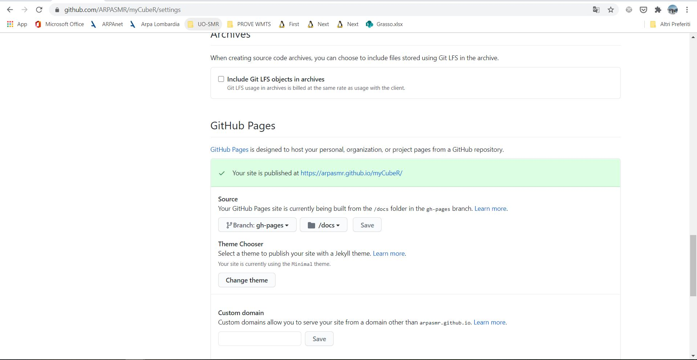

# INTRODUZIONE
Questo repository serve per configurare il Sito di GitHub Pages di ARPASMR, grazie al quale pubblicare online la documentazione o le pagine di Git di alcuni repository d'interesse.

**SI ACCEDE AL SITO DA [https://arpasmr.github.io](https://arpasmr.github.io/)**

**Si accede a tutte le varie GitHub pages dei vari repository settati inserendo dopo la root principale il nome del repository:**
<br>*Esempio:*
<br>Per accedere alla documentazione online del repository ARPASMR/myCubeR (https://github.com/ARPASMR/myCubeR) si accede da:
<br>**[https://arpasmr.github.io/myCubeR](https://arpasmr.github.io/myCubeR)**


# COME COSTRUIRE LE GITHUB PAGES
## Costruzione della home page principale [https://arpasmr.github.io](https://arpasmr.github.io/)
Il sito è stato costruito utilizzando il Tema Cayman https://pages-themes.github.io/cayman/

**Per la costruzione di questa pagina (ROOT) sono state consultate le guide:**

* [Getting Started with GitHub Pages](https://guides.github.com/features/pages/)
* Per tematismo della HomePage [https://github.com/pages-themes/cayman](https://github.com/pages-themes/cayman)
  * Il sito è stato impostato modificando il file *_config.yml*
  * La pagina principale è stata modificata modificando *index.md* 
  

NB: Ogni volta che si vuole aggiungere un link a un repository di documentazione nella pagina principale del sito è necessario aggiornare il file *index.md* . 

## Costruzione/configurazione delle pagine web di documentazione dei vari repository

Seguire quanto riportato nella guida: https://www.youtube.com/watch?edufilter=NULL&v=bwThn0rxv7M ovvero:

1. Creare per ogni repository in cui vi siano le pagine web da visualizzare un branch nominato ***gh-pages***
   
2. Settare le GitHub Pages di quel repository 
   


**NB Per tenere allineato il branch master con il branch gh-pages**
<br>Reference: http://lea.verou.me/2011/10/easily-keep-gh-pages-in-sync-with-master/

```
git add .
git status 					//#to see what changes are going to be commited
git commit -m 'Prova caricamento per GitHub Pages'
git push origin master

git checkout gh-pages   	//#go to the gh-pages branch. NB: PRIMA VOLTA BISOGNA CREARE IL BRANCH CON: git checkout -b gh-pages
git rebase master			//#bring gh-pages up to date with master
git push origin gh-pages	//#commit the changes
git checkout master	//#return to the master branch
```
